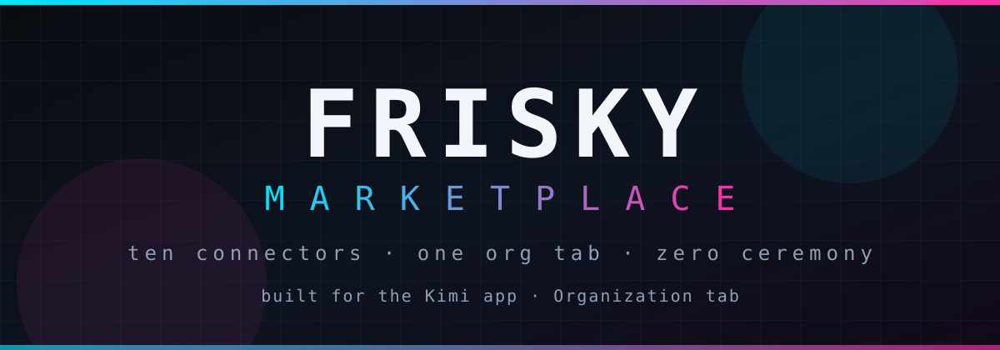
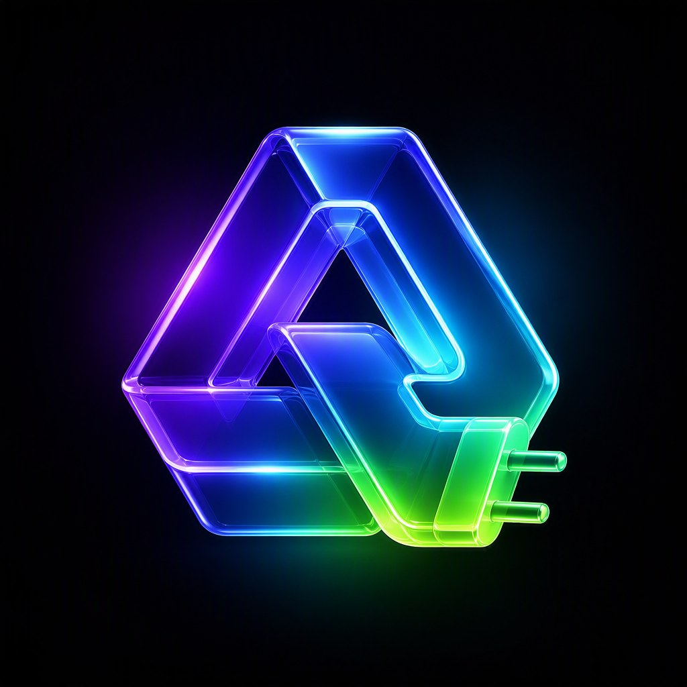
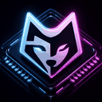

<div align="center">




**twelve connectors · one org tab · zero ceremony**

Personal plugin marketplace for the **Kimi** app. Add this repo in the
Directory's **Organization** tab — the app re-fetches it periodically, so
**every push here is a release**.

</div>

---

## The Roster

| # | | Plugin | What it wires into your chats | Category |
|---|-|--------|-------------------------------|----------|
| 01 |  | [**sentry-connector**](./sentry-connector) | Sentry's official MCP — errors, issues, traces, replays, release health | `DEVELOPER_TOOLS` |
| 02 |  | [**composio-connector**](./composio-connector) | Composio's hosted tool router — 1000+ apps behind one OAuth | `PRODUCTIVITY` |
| 03 |  | [**convex-connector**](./convex-connector) | Convex backend — projects, deployments, data | `DEVELOPER_TOOLS` |
| 04 |  | [**friskydev-mcp**](./friskydev-mcp) | FriskyDev gateway — 15 specialist operators + shared memory | `PRODUCTIVITY` |
| 05 |  | [**render**](./render) | Render.com — services, deploys, logs, cron jobs | `DEVTOOLS` |
| 06 |  | [**framer**](./framer) | Framer — pages, CMS collections, publish | `PRODUCTIVITY` |
| 07 |  | [**chatprd**](./chatprd) | ChatPRD — product docs on demand | `PRODUCTIVITY` |
| 08 |  | [**folios**](./folios) | Folios — evidence workspaces, playbooks | `PRODUCTIVITY` |
| 09 |  | [**cloudflare-connector**](./cloudflare-connector) | Cloudflare official MCP — Workers, Pages, KV, D1, R2, DNS, Zero Trust, Analytics | `DEVELOPER_TOOLS` |
| 10 |  | [**n8n-connector**](./n8n-connector) | Your self-hosted n8n instance MCP — workflows, executions, data tables | `PRODUCTIVITY` |
| 11 |  | [**perplexity**](./perplexity) | Perplexity official MCP — real-time web search, reasoning, conversational AI | `PRODUCTIVITY` |
| 12 |  | [**magic-patterns**](./magic-patterns) | Magic Patterns official MCP — prototype UI, design directions, production code handoff | `PRODUCTIVITY` |

## Install

1. Open the Kimi app → **Directory** → **Organization** tab
2. Paste this repo's URL:
   `https://github.com/FriskyDevelopments/frisky-marketplace`
3. Install plugins from the org marketplace as they appear

## Publish a New Plugin

```bash
# 1. drop the plugin folder at the repo root
cp -R ~/path/to/my-plugin ./my-plugin

# 2. add one entry to plugins.json
#    { "name": "my-plugin", "path": "./my-plugin", ... }

# 3. add an icon (used by the README roster + the app)
#    ./my-plugin/icon.svg  (or icon.png)

# 4. add a row to the Roster above, bump the plugin-count badge,
#    then push — the app picks it up on its next fetch
git add -A && git commit -m "add my-plugin" && git push
```

`plugins.json` is the native Kimi index — entries point at in-repo folders
(`path`) or external repos (`url`), with optional `description`, `category`,
and `owner` metadata.

## Layout

```
frisky-marketplace/
├── assets/
│   └── banner.svg        ← this README's hero
├── plugins.json          ← the index (name: "frisky")
├── README.md
└── <plugin>/             ← one folder per plugin:
    ├── kimi.plugin.json  ← manifest (name, version, interface, mcpServers)
    ├── icon.svg/png/jpg  ← roster + app icon
    └── skills/           ← optional skill instructions (some plugins)
```

---

<div align="center">
<sub>frisky developments · wired for friskypup</sub>
</div>
