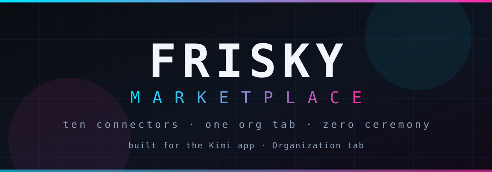
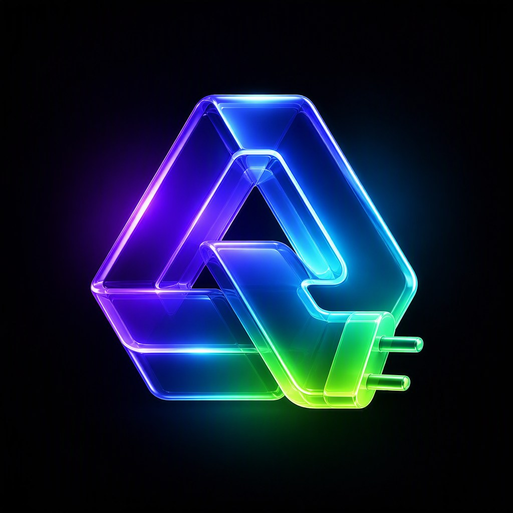
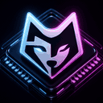
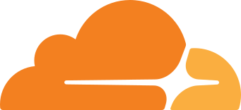

<div align="center">



<!-- BEGIN GENERATED COUNT -->

<!-- END GENERATED COUNT -->


<!-- BEGIN GENERATED TAGLINE -->
**12 connectors · one org tab · zero ceremony**
<!-- END GENERATED TAGLINE -->

Personal plugin marketplace for the **Kimi** app. Add this repo in the
Directory's **Organization** tab — the app re-fetches it periodically, so
**every push here is a release**.

</div>

---

## The Roster

<!-- BEGIN GENERATED ROSTER -->
| # | | Plugin | What it wires into your chats | Category |
|---|-|--------|-------------------------------|----------|
| 01 |  | [**chatprd**](./chatprd) | Push PRDs and FriskyClaw digests into ChatPRD | `PRODUCTIVITY` |
| 02 |  | [**composio-connector**](./composio-connector) | 在 Kimi 里使用 Composio Connector | `PRODUCTIVITY` |
| 03 |  | [**convex-connector**](./convex-connector) | 在 Kimi 里直连你的 Convex 项目 | `DEVELOPER_TOOLS` |
| 04 |  | [**folios**](./folios) | 在 Kimi 里使用 Folios | `PRODUCTIVITY` |
| 05 |  | [**framer**](./framer) | Diseña, edita y publica sitios Framer desde Kimi | `PRODUCTIVITY` |
| 06 |  | [**friskydev-mcp**](./friskydev-mcp) | Use Frisky Dev MCP in Kimi — 15 specialist operators with shared memory | `PRODUCTIVITY` |
| 07 |  | [**render**](./render) | 在 Kimi 里管理 Render 云服务 | `DEVTOOLS` |
| 08 |  | [**sentry-connector**](./sentry-connector) | 在 Kimi 里使用 Sentry Connector | `DEVELOPER_TOOLS` |
| 09 |  | [**cloudflare-connector**](./cloudflare-connector) | 在 Kimi 里使用 Cloudflare Connector | `DEVELOPER_TOOLS` |
| 10 |  | [**n8n-connector**](./n8n-connector) | 在 Kimi 里使用 n8n Connector | `PRODUCTIVITY` |
| 11 |  | [**perplexity**](./perplexity) | Search and reason with Perplexity inside sessions | `PRODUCTIVITY` |
| 12 |  | [**magic-patterns**](./magic-patterns) | Prototype and iterate UI with Magic Patterns | `PRODUCTIVITY` |
<!-- END GENERATED ROSTER -->

## Install

1. Open the Kimi app → **Directory** → **Organization** tab
2. Paste this repo's URL:
   `https://github.com/FriskyDevelopments/frisky-marketplace`
3. Install plugins from the org marketplace as they appear

## Publish a New Plugin

```bash
# 1. drop the plugin folder at the repo root
cp -R ~/path/to/my-plugin ./my-plugin

# 2. add one entry to plugins.json
#    { "name": "my-plugin", "path": "./my-plugin", ... }

# 3. add an icon (used by the README roster + the app)
#    ./my-plugin/icon.svg  (or icon.png)

# 4. regenerate the roster and count, then run the marketplace checks
.venv/bin/python -m scripts.generate_roster
.venv/bin/python -m unittest discover -s tests -v
#    then push — the app picks it up on its next fetch
git add -A && git commit -m "add my-plugin" && git push
```

`plugins.json` is the native Kimi index — entries point at in-repo folders
(`path`) or external repos (`url`), with optional `description`, `category`,
and `owner` metadata.

## Marketplace checks

```bash
python3 -m venv .venv
.venv/bin/python -m pip install -r requirements-test.txt
.venv/bin/python -m unittest discover -s tests -v
.venv/bin/python -m scripts.generate_roster --check
```

Every `kimi.plugin.json`, including unindexed plugins, is validated against the
checked-in `schemas/plugin-manifest.schema.json`. This is the repository's
offline contract, not a copy of the upstream Kimi schema. It checks known fields
while allowing extensions and existing category labels. CI runs the same tests;
it does not connect to MCP servers or deploy anything.

The roster, count badge, and connector tagline are generated from `plugins.json`
(in index order), using local manifest short descriptions and icons when present.
Run `.venv/bin/python -m scripts.generate_roster` after changing the index or those
manifest fields. Tests reject stale generated content; other README sections stay
hand-maintained. External `url` entries do not require a checkout.

Skill checks require each declared skills directory to contain skill folders with
nonempty `SKILL.md` files. Local inline/image and reference-style Markdown links
must resolve within the plugin; remote links are not fetched. A `sessionStart.skill`
must match a declared skill folder.

Index compatibility tests cover the native `{ "name": ..., "plugins": [...] }`
shape, exactly one local `path` or external HTTP(S) `url` per entry, optional
metadata (including multilingual descriptions and existing category labels),
unique plugin names/local paths, and matching local manifest names. Unknown
metadata remains allowed for forward compatibility.

## Layout

```
frisky-marketplace/
├── assets/
│   └── banner.svg        ← this README's hero
├── plugins.json          ← the index (name: "frisky")
├── README.md
└── <plugin>/             ← one folder per plugin:
    ├── kimi.plugin.json  ← manifest (name, version, interface, mcpServers)
    ├── icon.svg/png/jpg  ← roster + app icon
    └── skills/           ← optional skill instructions (some plugins)
```

---

<div align="center">
<sub>frisky developments · wired for friskypup</sub>
</div>
